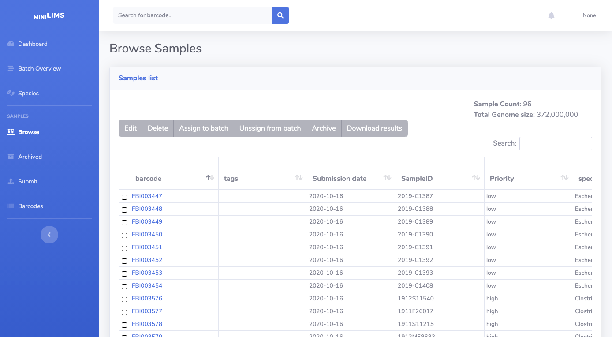
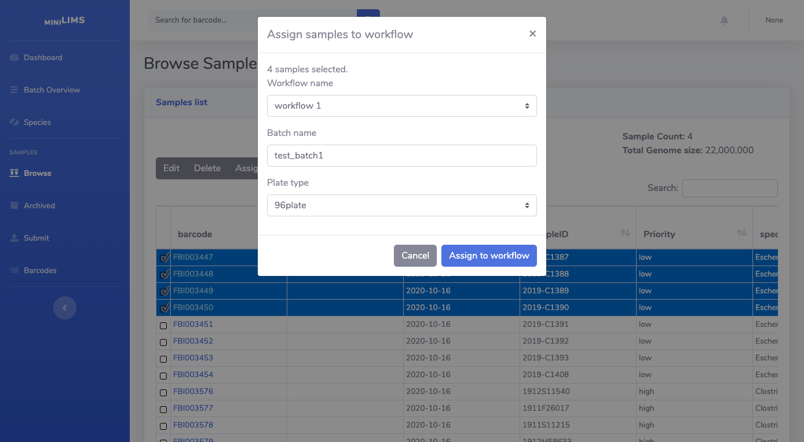
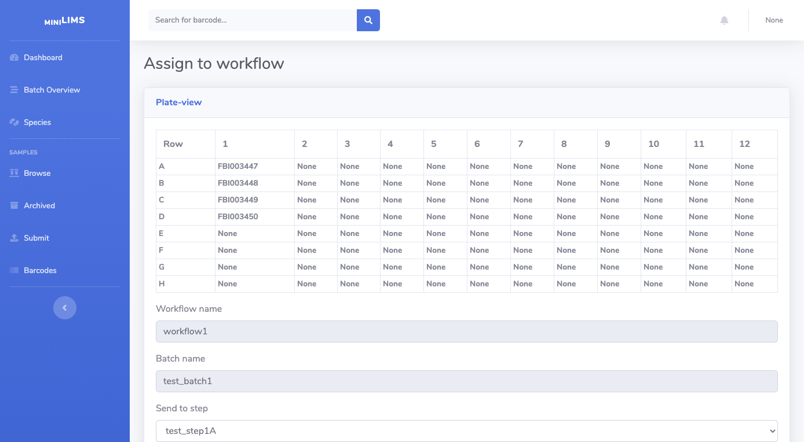
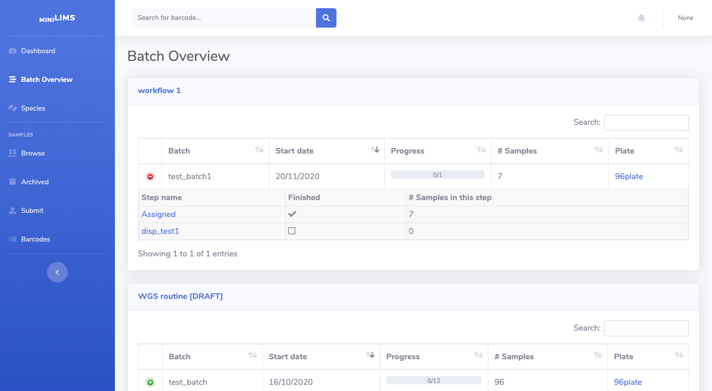
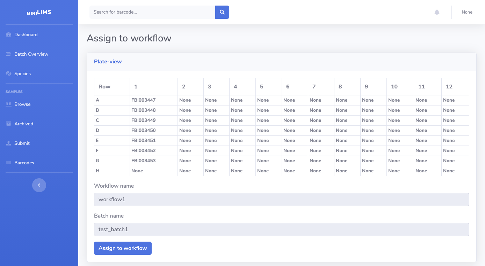
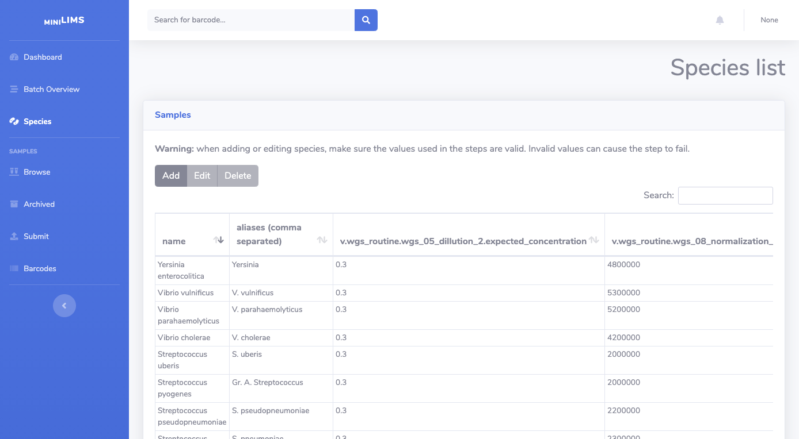

Admin user
==========

This is an overview of miniLIMS from the perspective of differen users to explain the full functionality of the system.

The main Dashboard provides a general view of the samples and the workflows.

Checking samples
----------------

The Browse view (on the left menu) will show a list of all samples in the system (except those that have been archived :ref:Archiving samples).
Here you can browse (including sorting and filtering), edit details, assign/unassign from workflows or archive samples.

Submitting to workflow
----------------------

From the Browse view you can select one or more samples and assign them to a batch in a workflow using the Assign to batch button.
A prompt will ask you which workflow, batch and plate type, if there are multiple plate types available.

If you enter a new batch name, a batch will be created with these samples. If you enter an existing batch name, 
your samples will be added to the existing batch.

The current view allows you to organize samples in the batch. The top shows the plate view:

And the bottom shows a table with the order. You can drag and drop samples here to fit the right order. The changes will be
reflected at the top.

When you're done, click Assign to workflow and the samples will be assigned.

Checking batch status
---------------------

The Batch Overview (left menu) will show the ongoing batches and the step they're in on the different workflows.

To reorganize a batch in a plate, you can click on the plate type. You'll be taken to the assign page where you can reorder samples
on the plate.

Adding or editing species
-------------------------

On the Species view (left menu) a table is shown with the species accepted by miniLIMS and the different values required by 
steps in workflows. You can add, remove or edit species here.

Archiving samples
-----------------

The number of samples on the sample Browse view can grow quickly. It is possible to archive samples that have finished their workflows.
Archived samples can be unarchived if needed.