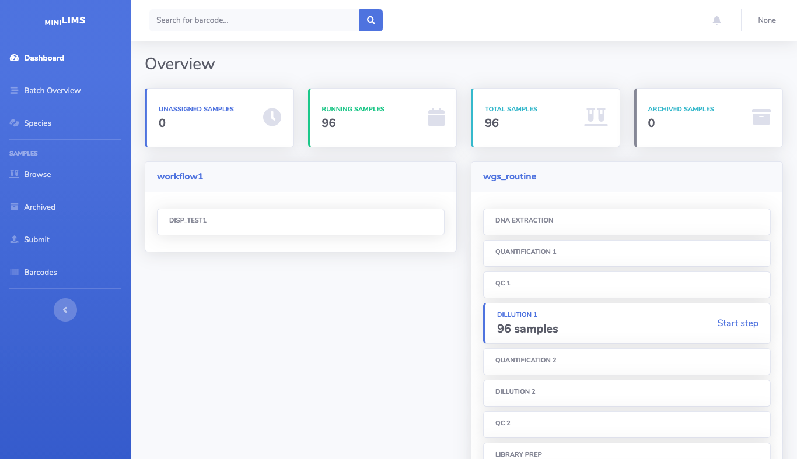

Welcome to miniLIMS's usage documentation!
==========================================

miniLIMS is originally developed to be used as LIMS system in the BPS department at SSI. LIMS systems can be quite different from each other and focus on different areas.
miniLIMS focuses on tracking samples in the lab and assisting in the workflow management. It can run scripts in between steps of a workflow, keep track of files and values from
previous steps, among other features.

