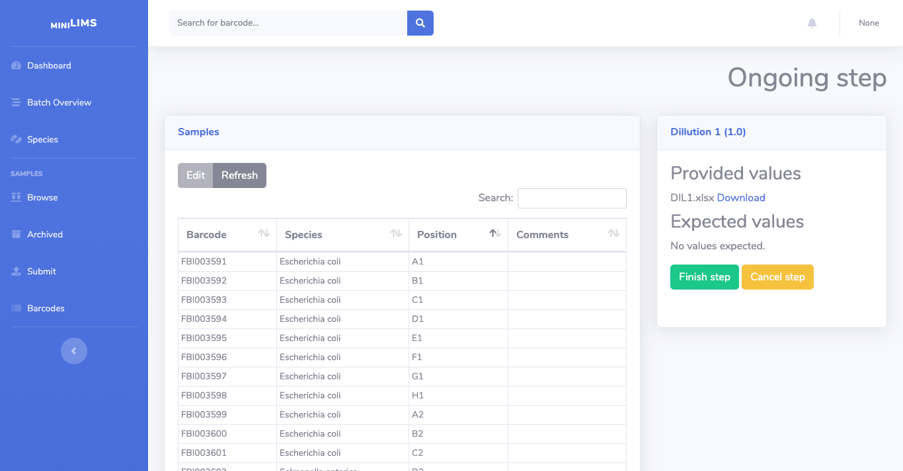

Lab technician user
===================

This is an overview of miniLIMS from the perspective of differen users to explain the full functionality of the system.

Dashboard
---------

The Dashboard shows an overview of the status of currently running samples and workflows. In this view you can see the available
workflows and in which step the samples are.

.. image:: images/dashboard.png

For each workflow, the steps are shown. If a step has samples ready, it will show the link "Start step"

An overview of the samples by batch can be seen in "Batch Overview" (left menu), and from there it is possible to go to 
the next steps as well.

.. image:: images/batch.png

Workflow
--------

Start step
^^^^^^^^^^

Once a step is selected, you'll see the "Starting step" view, which shows available samples for that step.

First select the batch in the dropdown in the right side. 
Most likely there will be only one batch for that step, unless two batches await the same step.

Then make sure that all samples are selected (the right box will show how many are selected) and click on Start step.

Ongoing step
^^^^^^^^^^^^

You will be taken to the Ongoing step view. Here you can see the step name, a description of what needs to be done, and relevant values.

Some steps may generate values or files to be used during the step.

Some steps may require values obtained during the step (values or files generated by an instrument). 

To finish the step click on Finish step. If you selected the wrong samples for the step or there are other issues, you can cancel the step.

Finished step
^^^^^^^^^^^^^

In this view you'll see the values saved for this step and the suggested next step in the workflow. 
Clicking on the Go button will take you to the Starting step view for the next step. 

