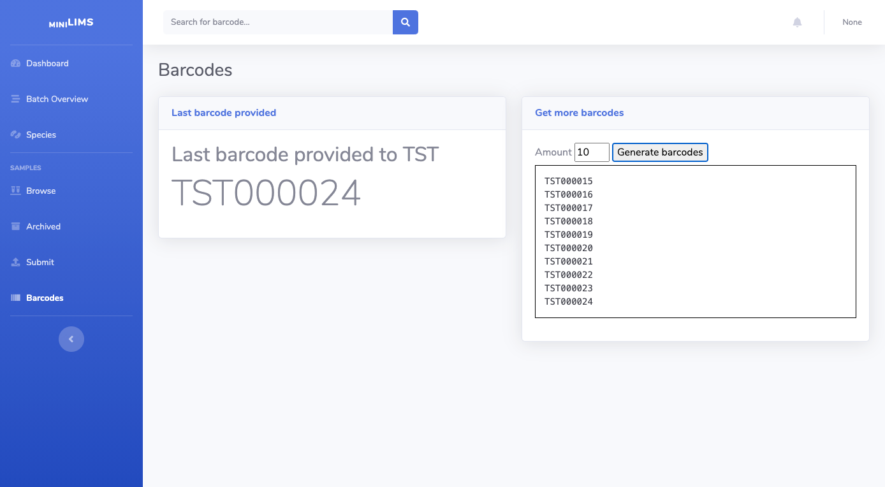
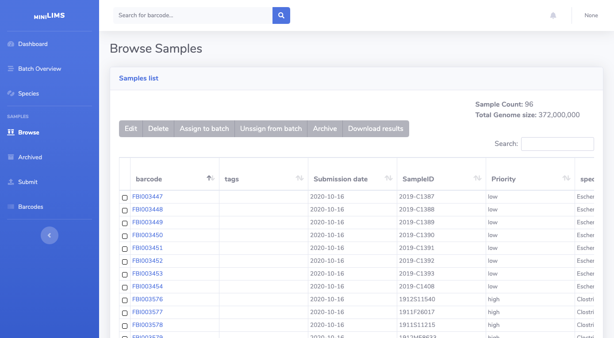

Supplying lab user
==================

This is an overview of miniLIMS from the perspective of differen users to explain the full functionality of the system.

Getting barcodes
----------------

Barcodes are what make samples in miniLIMS unique. If you try to submit a sample with a barcode that was already taken,
miniLIMS will not allow it. To help make sure multiple samples don't have the same barcode, miniLIMS will provide you
with a list of barcodes that you can use for your next batch of samples.

By going to the barcodes section (on the left menu), you will be shown with the latest barcode provided to your group.

Enter the amount of samples you plan on submitting on the right and click Generate barcodes. You'll be presented with a list
of barcodes you can use for your next batch. 

*Important:* miniLIMS will not accept barcodes that have not been generated this way. This is to prevent using the same barcode twice.
On the other hand, not using a barcode is fine.

Submitting samples
------------------

In the Submit menu on the left you can submit sample metadata to miniLIMS. Data can be entered manually or uploaded easily in groups by
using a samplesheet (click on Choose file). To get a template of the samplesheet you can ask an admin or generate one yourself using
the column names shown in the table.

The box marked as "Validation errors" will show any potential issues that you should fix before the samples can be uploaded.
You can select rows and edit them directly on the browser.

Checking sample status
----------------------

Once samples are submitted, they will eventually be assigned to a batch by a manager. You can see some basic information
about the samples you submitted by going into the Browse and Archived tabs. (Browse generally shows "active" samples and Archive 
shows samples that have been processed by the workflows).

As a supplying lab user, you can edit some sample details only before the sample has been assigned a batch. Once it's assigned,
please ask an admin for changes.

